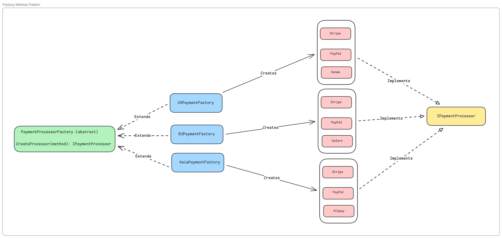
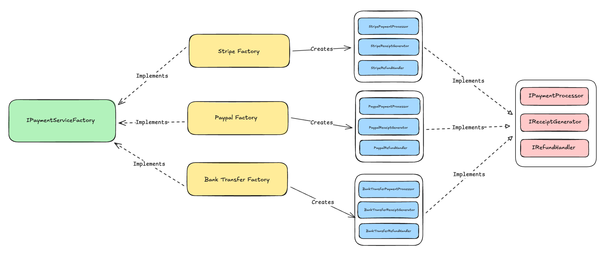

# Factory Pattern

The term "Factory Pattern" actually refers to **three related but distinct patterns**:

1. **Simple Factory** - One factory class with creation methods
2. **Factory Method** - Subclasses decide what to instantiate  
3. **Abstract Factory** - Creates families of related objects

---

## Table of Contents

- [Simple Factory](#simple-factory)
- [Factory Method](#factory-method)
- [Abstract Factory](#abstract-factory)
- [Pattern Comparison](#pattern-comparison)
- [When NOT to Use Factories](#when-not-to-use-factories)
- [Decision Tree](#decision-tree)

---

# Simple Factory

## The Problem

You have multiple payment processors (Credit Card, BKash, Bank Transfer) with different processing logic. Without a factory:

```csharp
// Client code has creation logic scattered everywhere
IPaymentProcessor processor;
if (paymentType == "CreditCard")
    processor = new CreditCardProcessor();
else if (paymentType == "BKash")
    processor = new BKashProcessor();
else if (paymentType == "BankTransfer")
    processor = new BankTransferProcessor();
```

Every time you add a new payment method, you modify client code everywhere.

---

## What is Simple Factory?

**Intent**: Centralize object creation logic in one place. The factory class decides which concrete class to instantiate based on input parameters.

**Structure**:
```
Client → Factory → Creates → IPaymentProcessor
                                  ↑
                                  |
                    ┌─────────────┼─────────────┐
                    |             |             |
            CreditCard       BKash      BankTransfer
```

---

## How It Solves the Problem

```csharp
// Factory centralizes creation
public class PaymentProcessorFactory
{
    private readonly Dictionary<string, IPaymentProcessor> _processors;

    public IPaymentProcessor GetPaymentProcessor(string paymentType)
    {
        if(_processors.TryGetValue(paymentType, out var processor))
            return processor;
        throw new ArgumentException($"Invalid payment type: {paymentType}");
    }
}

// Client code is much cleaner
var processor = _factory.GetPaymentProcessor("CreditCard");
var result = processor.ProcessPayment(100m, details);
```

### Benefits:
✅ Centralized creation logic  
✅ Easy to test  
✅ Single place to modify when adding new types  
✅ Client code doesn't know about concrete classes

---

## When to Use Simple Factory

✅ **Use when:**
- You have 3-10 product types
- Creation logic is straightforward (string → object mapping)
- All products share a common interface
- You don't need different factory variants

### Real-World Examples:
- Payment processors (Credit Card, PayPal, Crypto)
- Document parsers (JSON, XML, CSV)
- Logger implementations (File, Console, Database)
- Connection types (HTTP, HTTPS, FTP, SFTP)


*Figure 1: Simple Factory Pattern - Centralized object creation*

---

# Factory Method

## The Problem Simple Factory Can't Solve

Imagine your platform operates in multiple regions, each with different payment providers:

- **US Region**: Stripe, PayPal, Venmo
- **EU Region**: Stripe, PayPal, Sofort  
- **Asia Region**: Stripe, PayPal, Alipay

With Simple Factory, you'd need complex if-else chains:

```csharp
public IPaymentProcessor GetProcessor(string region, string method)
{
    if (region == "US")
    {
        return method switch { "stripe" => ..., "venmo" => ... };
    }
    else if (region == "EU")
    {
        return method switch { "stripe" => ..., "sofort" => ... };
    }
    // More regions...
}
```

This violates the Open/Closed Principle.

---

## What is Factory Method?

**Intent**: Define an interface for creating objects, but let subclasses decide which class to instantiate. Factory Method delegates instantiation to subclasses.

**Structure**:
```
                 PaymentProcessorFactory (abstract)
                    CreateProcessor(method)*
                              ↑
                              |
            ┌─────────────────┼─────────────────┐
            |                 |                 |
    USPaymentFactory  EUPaymentFactory  AsiaPaymentFactory
         creates            creates           creates
            ↓                  ↓                 ↓
    Stripe, Venmo      Stripe, Sofort    Stripe, Alipay
```

---

## How It Solves the Problem

```csharp
// Abstract factory defines the factory method
public abstract class PaymentProcessorFactory
{
    public abstract IPaymentProcessor CreatePaymentProcessor(string method);
    
    public PaymentResult ProcessPayment(string method, decimal amount, PaymentDetails details)
    {
        var processor = CreatePaymentProcessor(method);
        return processor.ProcessPayment(amount, details);
    }
}

// Each region has its own factory
public class USPaymentFactory : PaymentProcessorFactory
{
    public override IPaymentProcessor CreatePaymentProcessor(string method)
    {
        return method.ToLower() switch
        {
            "stripe" => new StripeProcessor(),
            "paypal" => new PayPalProcessor(),
            "venmo" => new VenmoProcessor(),
            _ => throw new ArgumentException($"Method '{method}' not supported in US")
        };
    }
}
```

### Benefits:
✅ **Open/Closed Principle** - Add new regional factories without modifying existing code  
✅ **Polymorphic factories** - Each region encapsulates its creation logic  
✅ **Scalable** - Easy to add new regions

---

## When to Use Factory Method

✅ **Use when:**
- You need **multiple variants** of factories (regional, versioned, themed)
- Each factory variant creates different sets of products
- You want subclasses to determine object creation

### Real-World Examples:
- Regional payment gateways (US, EU, Asia)
- Platform-specific UI components (iOS, Android, Web)
- Database provider factories (SQL Server, PostgreSQL, MySQL)
- Environment-specific configurations (Dev, Staging, Prod)


*Figure 2: Factory Method Pattern - Each region has its own factory*

---

# Abstract Factory

## The Problem Factory Method Can't Solve

Now your payment system needs more than just payment processing. For each provider, you also need:

- **Payment Processor** - Processes the payment
- **Receipt Generator** - Generates receipts in provider's format
- **Refund Handler** - Handles refunds through provider's API

**The catch**: These components must be **compatible**. You can't mix:

❌ Stripe payment + PayPal receipt + Venmo refund → **Inconsistent**  
✅ Stripe payment + Stripe receipt + Stripe refund → **Consistent family**

---

## What is Abstract Factory?

**Intent**: Provide an interface for creating **families of related objects** without specifying their concrete classes. Ensures created objects are compatible.

**Structure**:
```
IPaymentServiceFactory
       ↓ creates family
    Processor + Receipt + Refund
       ↑
       |
    ┌──┴──┬──────┬────────┐
    |     |      |        |
  Stripe PayPal Bank  (each creates compatible family)
```

---

## How It Solves the Problem

```csharp
// Abstract factory interface
public interface IPaymentServiceFactory
{
    IPaymentProcessor CreatePaymentProcessor();
    IReceiptGenerator CreateReceiptGenerator();
    IRefundHandler CreateRefundHandler();
}

// Stripe family
public class StripeServiceFactory : IPaymentServiceFactory
{
    public IPaymentProcessor CreatePaymentProcessor() 
        => new StripePaymentProcessor();
    
    public IReceiptGenerator CreateReceiptGenerator() 
        => new StripeReceiptGenerator();  // PDF format
    
    public IRefundHandler CreateRefundHandler() 
        => new StripeRefundHandler();
}

// PayPal family
public class PayPalServiceFactory : IPaymentServiceFactory
{
    public IPaymentProcessor CreatePaymentProcessor() 
        => new PayPalPaymentProcessor();
    
    public IReceiptGenerator CreateReceiptGenerator() 
        => new PayPalReceiptGenerator();  // JSON format
    
    public IRefundHandler CreateRefundHandler() 
        => new PayPalRefundHandler();  // Charges refund fee
}

// Client uses entire family
public class PaymentService
{
    private readonly IPaymentServiceFactory _factory;
    
    public void ProcessTransaction(decimal amount)
    {
        var processor = _factory.CreatePaymentProcessor();
        var receiptGenerator = _factory.CreateReceiptGenerator();
        var refundHandler = _factory.CreateRefundHandler();
        
        // All components guaranteed to work together
        var result = processor.ProcessPayment(amount, details);
        var receipt = receiptGenerator.GenerateReceipt(result);
        // ... All use the same provider's APIs
    }
}
```

### Benefits:
✅ **Guarantees compatibility** - All products from same family  
✅ **Isolates concrete classes** - Client doesn't know about Stripe/PayPal classes  
✅ **Easy to swap families** - Change factory, get entire new family  
✅ **Consistency** - Related objects work together

---

## When to Use Abstract Factory

✅ **Use when:**
- You need to create **multiple related objects** that must work together
- System should be independent of how its products are created
- Family of related products must be used together
- You want to enforce compatibility constraints

### Real-World Examples:
- UI toolkit themes (Light Theme: Button + TextBox + Menu; Dark Theme: Button + TextBox + Menu)
- Payment service families (Processor + Receipt + Refund)
- Cross-platform libraries (Windows: Window + Button; Mac: Window + Button)
- Database access layers (SQL Server: Connection + Command + DataReader)


*Figure 3: Abstract Factory Pattern - Creating compatible product families*

---

# Pattern Comparison

| Aspect            | Simple Factory              | Factory Method                | Abstract Factory                                |
| ----------------- | --------------------------- | ----------------------------- | ----------------------------------------------- |
| **Structure**     | One factory class           | Abstract factory + subclasses | Factory interface + families                    |
| **Purpose**       | Create one type of product  | Multiple factory variants     | Create product families                         |
| **Products**      | Single product type         | Single product type           | Related product families                        |
| **Extensibility** | Modify factory class        | Add new subclass              | Add new factory implementation                  |
| **Use Case**      | 3-10 product types          | Regional/versioned factories  | Related products must work together             |
| **Example**       | Payment processor selection | US vs EU payment factories    | Stripe ecosystem (processor + receipt + refund) |

---

# When NOT to Use Factories

## ❌ Anti-Pattern 1: Over-Engineering Simple Creation

```csharp
// ❌ Bad: Factory for simple DTOs
public class UserFactory
{
    public User CreateUser(string name, string email)
    {
        return new User { Name = name, Email = email };
    }
}

// ✅ Good: Direct instantiation
var user = new User { Name = "John", Email = "john@example.com" };
```

**Rule**: If object creation is just property assignment with no logic, don't use a factory.

---

## ❌ Anti-Pattern 2: Factory Method with One Implementation

```csharp
// ❌ Bad: Premature abstraction
public abstract class EmailServiceFactory
{
    public abstract IEmailService CreateEmailService();
}

public class SmtpEmailServiceFactory : EmailServiceFactory
{
    public override IEmailService CreateEmailService()
    {
        return new SmtpEmailService();
    }
}

// ✅ Good: Wait until you have 2+ variants
var emailService = new SmtpEmailService();
```

**Rule**: **YAGNI** (You Aren't Gonna Need It). Don't create factory hierarchies for single implementations.

---

## ❌ Anti-Pattern 3: God Factory

```csharp
// ❌ Bad: One factory creates everything
public class ApplicationFactory
{
    public IPaymentProcessor CreatePaymentProcessor() { ... }
    public ILogger CreateLogger() { ... }
    public IDatabase CreateDatabase() { ... }
    public IEmailService CreateEmailService() { ... }
}

// ✅ Good: Use Dependency Injection
services.AddScoped<IPaymentProcessor, StripeProcessor>();
services.AddSingleton<ILogger, FileLogger>();
```

**Rule**: Factories create **related objects**. For unrelated dependencies, use a DI container.

---

## ❌ Anti-Pattern 4: Factory for Configuration Differences

```csharp
// ❌ Bad: Separate classes for config variations
public class DevDatabaseFactory : DatabaseFactory { }
public class ProdDatabaseFactory : DatabaseFactory { }

// ✅ Good: Use configuration
var connectionString = config.GetConnectionString("Default");
var db = new DatabaseConnection(connectionString);
```

**Rule**: If the only difference is **data** (URLs, credentials), use configuration, not inheritance.

---

## ❌ Anti-Pattern 5: Hiding Business Logic in Factory

```csharp
// ❌ Bad: Factory doing too much
public class OrderFactory
{
    public Order CreateOrder(Customer customer, List<Item> items)
    {
        // Validate customer credit
        if (customer.CreditScore < 500) throw new Exception();
        
        // Calculate discounts, tax, check inventory, send notifications...
        // This is business logic, not object creation!
    }
}

// ✅ Good: Separate concerns
public class OrderFactory
{
    public Order CreateOrder(OrderDetails details)
    {
        return new Order
        {
            OrderId = Guid.NewGuid(),
            Items = details.Items,
            Status = OrderStatus.Pending
        };
    }
}

public class OrderService  // Business logic here
{
    public async Task<Order> ProcessOrder(OrderDetails details)
    {
        await _validator.ValidateCustomer(details.CustomerId);
        var order = _factory.CreateOrder(details);
        return order;
    }
}
```

**Rule**: Factories create objects. Services orchestrate workflows.

---

# Decision Tree

```
Do you need to create objects?
│
├─ Just one type of object with simple mapping
│  ├─ 1-2 variants → Don't use factory, use if-else
│  └─ 3+ variants → Use Simple Factory ✅
│
├─ One type, but multiple creation strategies (regional, versioned)
│  └─ Use Factory Method ✅
│
└─ Multiple related objects that must be compatible
   └─ Use Abstract Factory ✅
```

---

# Red Flags You're Overusing Factories

❌ Every class has a corresponding factory  
❌ Factories with only one implementation  
❌ Factories that do business logic  
❌ Nested factories (factories creating factories creating factories)  
❌ God factories that create everything  
❌ Using factories when DI container would be simpler

---

# When TO Use Factories

✅ **Object creation is complex** (multiple dependencies, validation, setup)  
✅ **You have 3+ variants** that need to be chosen at runtime  
✅ **Objects must be compatible** (families in Abstract Factory)  
✅ **Decoupling is critical** (client shouldn't know concrete class)  
✅ **Creation logic will change** independently from usage

---

# Key Takeaways

> **Simple Factory**: One factory, one product type, simple mapping  
> **Factory Method**: Multiple factories (subclasses), one product type  
> **Abstract Factory**: Multiple factories, multiple related products (families)

> **Don't use factories for everything**  
> 1-2 variants? Use if-else.  
> Configuration differences? Use config files.  
> Unrelated objects? Use DI container.

> **Factories are about creation, not business logic**  
> Keep factories focused on object instantiation.  
> Move validation, calculation, and orchestration to services.
