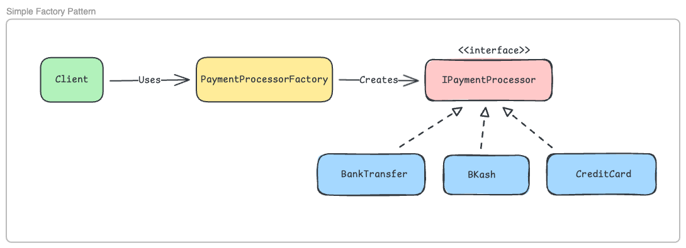

# Simple Factory Pattern

## Overview

Simple Factory is the most commonly used factory pattern. It centralizes object creation logic in one place, eliminating duplicate code and making the codebase easier to maintain.

See the main [Factory Pattern README](../README.md) for a complete comparison with Factory Method and Abstract Factory.

---

## The Problem

We have multiple services (Checkout, Subscription, Refund, Cart Preview) that all need to create payment processors. Without a factory, the same creation logic is duplicated everywhere:

```csharp
// In CheckoutService
if (paymentType == "CreditCard")
    processor = new CreditCardProcessor();
else if (paymentType == "BKash")
    processor = new BKashProcessor();
// ...

// In SubscriptionService - SAME CODE AGAIN
if (paymentType == "CreditCard")
    processor = new CreditCardProcessor();
else if (paymentType == "BKash")
    processor = new BKashProcessor();
// ...

// In RefundService - SAME CODE AGAIN
// In CartPreviewService - SAME CODE AGAIN
```

**Problems:**
1. Code duplication - violates DRY principle
2. Hard to maintain - adding PayPal requires changing 5+ classes
3. Error-prone - easy to forget updating one service
4. Testing is harder - can't easily mock creation

See [Problem.cs](Problem.cs) for the full problematic code.

---

## Solution: Simple Factory

**Intent**: Centralize object creation logic in a single factory class.

**Structure**:



*The factory acts as a single point of creation, eliminating duplicate if-else chains.*

---

## How It Works

### Step 1: Create the Factory

```csharp
public class PaymentProcessorFactory
{
    private readonly Dictionary<string, IPaymentProcessor> _processors;

    public PaymentProcessorFactory()
    {
        _processors = new Dictionary<string, IPaymentProcessor>(StringComparer.OrdinalIgnoreCase)
        {
            { "CreditCard", new CreditCardProcessor() },
            { "BKash", new BKashProcessor() },
            { "BankTransfer", new BankTransferProcessor() }
        };
    }

    public IPaymentProcessor GetPaymentProcessor(string paymentType)
    {
        if (_processors.TryGetValue(paymentType, out var processor))
            return processor;
        
        throw new ArgumentException($"Invalid payment type: {paymentType}");
    }
}
```

### Step 2: Use in Services

```csharp
public class CheckoutService
{
    private readonly PaymentProcessorFactory _factory;

    public CheckoutService(PaymentProcessorFactory factory)
    {
        _factory = factory;
    }

    public void ProcessCheckout(string paymentType, decimal amount, PaymentDetails details)
    {
        var processor = _factory.GetPaymentProcessor(paymentType);
        var result = processor.ProcessPayment(amount, details);
    }
}
```

Now all services use the factory. No duplicate creation logic!

---

## Benefits

✅ **Centralized Creation** - One place to add new payment types  
✅ **DRY Principle** - No code duplication  
✅ **Easy to Test** - Factory can be mocked  
✅ **Easy to Extend** - Add PayPal by updating factory dictionary only  
✅ **Type Safety** - Compile-time errors for typos (with enum keys)

---

## When to Use Simple Factory

✅ **Use when:**
- You have **3-10 product variants**
- Creation logic is straightforward (string → object mapping)
- All products share a common interface
- You don't need different factory behaviors

### Real-World Examples:
- Payment processor selection (Credit Card, PayPal, Crypto)
- Document parsers (JSON, XML, CSV)
- Logger implementations (File, Console, Database)
- Connection types (HTTP, HTTPS, FTP, SFTP)
- Notification channels (Email, SMS, Push)

---

## When NOT to Use Simple Factory

❌ **Don't use when:**

1. **You have only 1-2 variants**
   ```csharp
   // Overkill for boolean choice
   var processor = isPremium 
       ? new PremiumProcessor() 
       : new StandardProcessor();
   ```

2. **Differences are just configuration**
   ```csharp
   // ❌ Bad: Factory for config
   public class DevDatabaseFactory { }
   public class ProdDatabaseFactory { }
   
   // ✅ Good: Use config
   var connString = config.GetConnectionString("Default");
   ```

3. **You need multiple factory variants** (regional, versioned)
   - Use Factory Method instead

4. **You need product families** (related objects must be compatible)
   - Use Abstract Factory instead

---

## Simple Factory vs Others

| Pattern              | Use When                                 | Example                      |
| -------------------- | ---------------------------------------- | ---------------------------- |
| **Simple Factory**   | 3-10 product types, simple mapping       | Payment processor selection  |
| **Factory Method**   | Need regional/versioned factory variants | US vs EU payment gateways    |
| **Abstract Factory** | Need compatible product families         | Processor + Receipt + Refund |

**Rule of Thumb**: Start with Simple Factory. 90% of the time, it's all you need.

---

## Key Takeaways

> **Simple Factory is the workhorse of the factory family.**

> **Use it to eliminate duplicate creation logic.**

> **Most real-world scenarios only need Simple Factory.**

> **Move to Factory Method/Abstract Factory only when Simple Factory can't handle the complexity.**

---

For a complete comparison of all three factory patterns, see the [main Factory Pattern README](../README.md).
